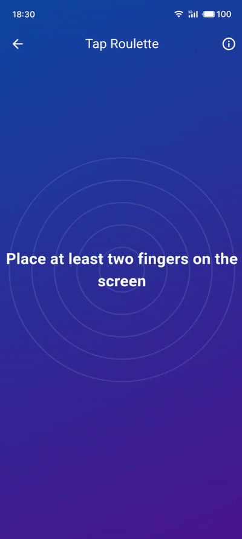

<div align="center">
    <h2>📢 Recommended App</h2>
    <p>This Finger Roulette is just one feature of the Snibox all-in-one toolbox.</p>
    <p>Want to experience more useful tools? Download Snibox for a comprehensive productivity boost!</p>
    <div align="center">
    
    <h1 style="border-bottom: none;">Snibox</h1>
   </div>
    <a href="https://apps.apple.com/en/app/id6572311811">
        
    </a>
</div>

# Finger Roulette

Finger Roulette is a fun, interactive Flutter app that brings the excitement of roulette to your mobile device with a twist - it uses your fingers as the players!




## Features

- Supports multiple players (minimum 2)
- Engaging countdown and selection animations
- Vibration feedback for an immersive experience
- Colorful player indicators
- Sleek, gradient background with decorative elements

## How to Play

1. Place at least two fingers on the screen.
2. Wait for the countdown to finish.
3. Watch as the game cycles through all players.
4. A winner is randomly selected!

## Getting Started

### Prerequisites

- Flutter SDK
- Dart SDK
- Android Studio or VS Code with Flutter extensions

### Installation

1. Clone the repository:
   ```
   git clone https://github.com/aidevjoe/Finger-Roulette.git
   ```
2. Navigate to the project directory:
   ```
   cd Finger-Roulette
   ```
3. Get the dependencies:
   ```
   flutter pub get
   ```
4. Run the app:
   ```
   flutter run
   ```

## Dependencies

- `flutter`: The main framework
- `vibration`: For haptic feedback

## License

Distributed under the MIT License. See `LICENSE` for more information.

## Acknowledgements

- [Flutter](https://flutter.dev)
- [Dart](https://dart.dev)
- [vibration](https://pub.dev/packages/vibration)